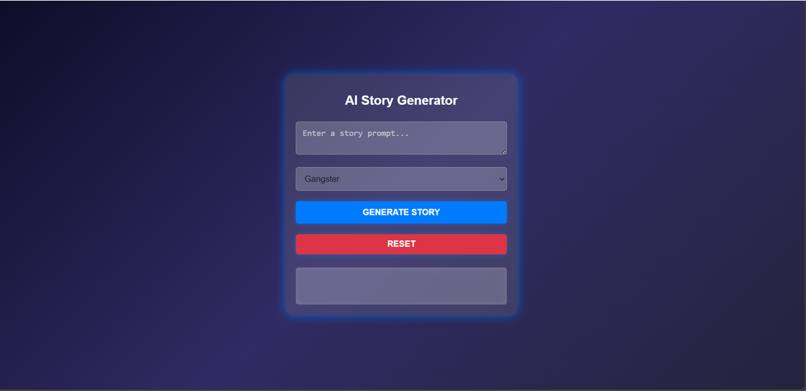
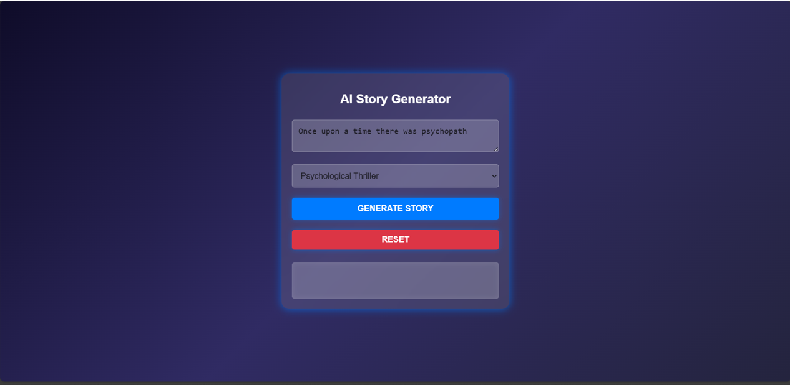
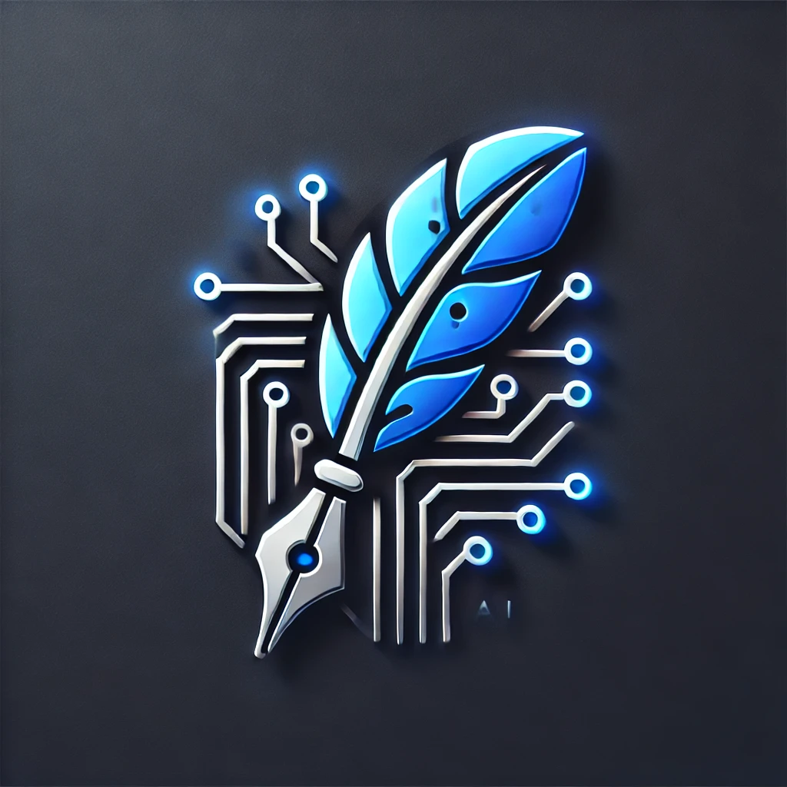

# AI Story Generator

 A simple where users can use simple prompts to develop small snippets of stories that the user can work on further.

---

## 📸 **Demo Images**

### 1️⃣ **Interface After Code Execution**
  
_The interface displayed after executing the AI Story Generator._

### 2️⃣ **Adding the Prompt**
  
_The user interface showing the input field where the prompt is added._

### 3️⃣ **During the Generation Phase**
  
_Screenshot showing the application during the text generation phase._

### 4️⃣ **After the Output is Generated**
  
_The output displayed after the AI generates the story from the prompt._

---

## 🌐 **Frontend**
- **HTML5**: Markup language for structuring content.
- **CSS3**: Styles and layout design to enhance user experience.
- **JavaScript**: Interactive behavior and dynamic functionality for the web.

---

## 🖥️ **Backend**
- **Flask**: Python-based frameworks to build APIs and web applications.

---

## 🤖 **Machine Learning**
- **TinyLlama-1.1B-chat-v1.0 model**: Model for text generation.
- **Hugging Face Transformers**: Library for NLP tasks, used to load and run the language model.

---

## **Attributions**
- **StoryCraft AI Logo:** Generated using [DALL·E](https://openai.com/dall-e) by OpenAI.
- 

